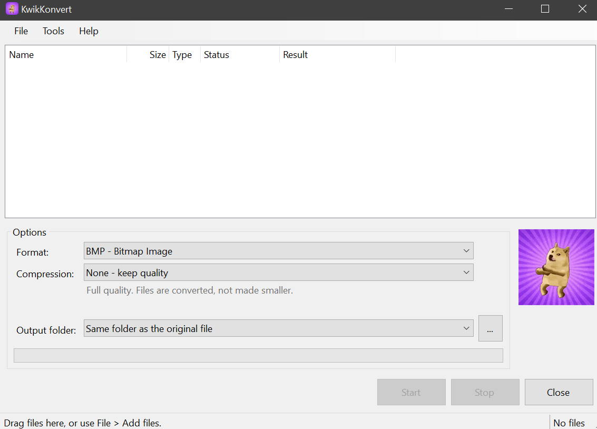
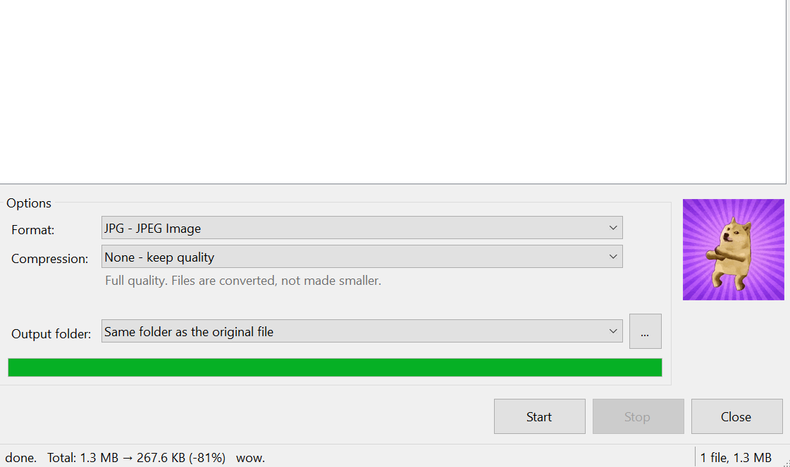

<div align="center">


# KwikKonvert

**Convert files. Make them smaller. Keep them on your PC.**

A native Windows utility for image, audio and video conversion, compression and ZIP archives.

[](#requirements)
[](https://github.com/DinoJTV/kwikkonvert/actions/workflows/build.yml)
[](https://github.com/DinoJTV/kwikkonvert/releases/latest)

**[Download for Windows](https://github.com/DinoJTV/kwikkonvert/releases/latest)** · **[User guide](docs/USER_GUIDE.md)** · **[Report a bug](https://github.com/DinoJTV/kwikkonvert/issues/new?template=bug_report.yml)**

*such files. many formats. wow.*

</div>

## What you can do

- **Convert images, audio and video** using the codecs available on your Windows PC.
- **Make files smaller** with Light, Normal, Strong and Maximum compression presets.
- **Fit a size limit** with 10 MB, 25 MB or custom targets; the app reports when a target cannot be reached.
- **Create a single ZIP** from files and folders, preserving folder structure.
- **Work from File Explorer** with right-click conversion and compression commands.
- **Process a batch** with progress, cancellation, time estimates and local history.

File processing happens locally. No account or API key is required. Outputs use new filenames, and compression results are only kept when they meet the app's size checks. Pictures, audio and video may lose quality when compressed; ZIP compression is lossless.

## Get started

1. Open **[Releases](https://github.com/DinoJTV/kwikkonvert/releases/latest)** and download `KwikKonvert-1.1.0-windows-x64.zip` from **Assets**.
2. Extract both files into a permanent folder and run `KwikKonvert.exe`. The x64 download includes its .NET runtime; `KwikKonvert.Core.pdb` provides debugging symbols.
3. Drop files or folders into the window, or use **File → Add files**.
4. Choose a **Format**, **Compression** preset and **Output folder**, then select **Start**.

The first published executable is unsigned. Releases include a SHA-256 checksum for checking that a download matches the published file; a checksum does not establish publisher identity.

The ZIP contains only `KwikKonvert.exe` and `KwikKonvert.Core.pdb`. No personal AppData, settings, history, logs or sample files are bundled. On a PC without existing KwikKonvert settings, the app starts with defaults and creates its own local data under `%LocalAppData%\KwikKonvert`.

## Screenshots

### Main window



### A completed conversion



This user-provided example shows an 81% size reduction. Results vary with the source file, chosen format and quality settings.

## Requirements

| | Requirement |
|---|---|
| Operating system | Windows 10 version 1809 or later, or Windows 11 |
| Download architecture | Windows x64 |
| Runtime | Included in the self-contained release executable |
| Optional codecs | Some formats need Windows codec extensions; use **Help → Formats on this PC** to check availability |
| Building from source | Windows and a .NET SDK capable of targeting .NET 8 |

An ARM64 build can be produced from source. The attached v1.1.0 download is x64.

## Supported file types

Support depends on installed codecs. The app offers compatible targets for the selected files.

| Type | Typical input | Output |
|---|---|---|
| Images | PNG, JPG, BMP, GIF, TIFF, ICO, JPEG-XR, DDS, WebP; additional formats with Windows extensions | PNG, JPG, BMP, GIF, TIFF, JPEG-XR; HEIC where supported |
| Video | MP4, MOV, M4V, MKV, AVI, WMV, 3GP, MTS/M2TS, TS, ASF; WebM with suitable codecs | MP4 (H.264/AAC), WMV |
| Audio | MP3, M4A, AAC, WAV, WMA, FLAC; audio extraction from supported video | MP3, M4A, WAV, WMA, FLAC |
| Other files | Documents, executables and other file types | ZIP archives |

Document files can be zipped; document-to-document conversion (such as PDF to Word) is not provided.

## Compression at a glance

| Preset | Video limit | Audio bitrate | JPG quality / image size |
|---|---|---|---|
| Light | Up to 1080p / 5 Mbps | 160 kbps | 85% / 3840 px |
| Normal | Up to 720p / 2.5 Mbps | 128 kbps | 75% / 2560 px |
| Strong | Up to 480p / 1.2 Mbps | 96 kbps | 60% / 1920 px |
| Maximum | Up to 360p / 0.6 Mbps | 64 kbps | 45% / 1280 px |

Images and videos are not upscaled. Already-compressed files may not become smaller. See the [user guide](docs/USER_GUIDE.md) for size targets, ZIP behaviour and format-specific details.

## Build and test

From a Windows terminal at the repository root:

```powershell
# Run the dependency-free core test suite.
dotnet run --project tests/KwikKonvert.Core.Tests -c Release

# Publish a self-contained, single-file Windows x64 build.
dotnet publish src/KwikKonvert/KwikKonvert.csproj -c Release -p:Platform=x64 -r win-x64 --self-contained true -p:KwikSingleFile=true -o publish/win-x64
```

For ARM64, change `Platform=x64` to `Platform=ARM64`, and `win-x64` to `win-arm64` in both places. Alternatively, `build.ps1` runs the tests and publishes a self-contained folder; use `-Platform ARM64` for ARM PCs.

The legacy `build.bat` has an interactive cleanup flow, including an option to delete source files. Use the commands above for normal repository development.

## Project layout

```text
src/KwikKonvert/              Windows Forms app, native codecs and Explorer integration
src/KwikKonvert.Core/         Format rules, compression settings, queues and local data
tests/KwikKonvert.Core.Tests/ Dependency-free core test runner
docs/                        Detailed usage documentation
.github/                     Build automation and contribution templates
```

The core test suite covers queue behaviour, cancellation, output naming, ZIP round trips, format rules and compression presets. Windows codec conversion and the desktop interface require manual testing on Windows.

## Help and contributions

See [CONTRIBUTING.md](CONTRIBUTING.md) before opening a pull request. For bugs, include your Windows version, app version, file type, selected options and the exact error message. Use non-sensitive sample files.

## Remove the app

Run `KwikKonvert.exe --unregister` to remove its Explorer entries, then delete the executable. Preferences and history are stored under `%LocalAppData%\KwikKonvert`; delete that folder if you also want to remove local app data.
